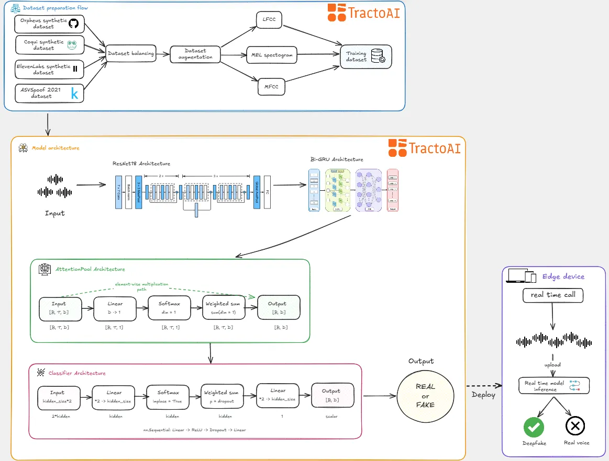

# DeepfakeDetector - Real-time Deepfake Audio Detection

A complete edge deployment pipeline for real-time deepfake detection during phone calls. This Android application uses multi-channel feature extraction and on-device PyTorch Mobile inference to detect synthetic audio without cloud connectivity. This project is the implementation of the solution described in **Deepfakes on the Edge: Building Smarter Detection Where It Counts.**



## Table of Contents
- [Overview](#overview)
- [Features](#features)
- [Key Technical Achievements](#key-technical-achievements)
- [Prerequisites](#prerequisites)
- [Installation](#installation)
- [Usage](#usage)
- [Core Components](#core-components)
- [Project Structure](#project-structure)
- [Development](#development)
- [License](#license)

## Overview

This project implements a complete pipeline for edge-deployed deepfake detection, from feature extraction to real-time inference.

**Feature Extraction Process:**
- Multi-channel audio analysis: MelSpectrogram, MFCC, LFCC features
- 6-second audio chunks processed at 16kHz sample rate
- Dynamic tensor shapes with time alignment across feature channels
- Real-time processing with <1s latency per chunk

**Model Training & Deployment:**
- 3-channel input tensor: `[batch, 3, 64, time_steps]`
- PyTorch Mobile quantized models for edge deployment
- Binary classification with sigmoid activation
- CPU inference optimized for Android devices

**Edge Integration:**
- Android foreground service with automatic call detection
- Real-time visual overlay with confidence-based threat levels
- 100% local processing - no network connectivity required
- Privacy-first design with in-memory audio processing

## Features

- **Multi-Channel Analysis**: MelSpectrogram + MFCC + LFCC feature extraction
- **Edge Deployment**: PyTorch Mobile with CPU-optimized inference
- **Real-Time Alerts**: Visual overlay with confidence-based threat detection
- **Auto-Activation**: Foreground service monitors calls automatically
- **Privacy-First**: 100% local processing, no data transmission
- **Cross-Architecture**: ARM64-v8a and ARMv7 Android support

## Key Technical Achievements

**Performance Metrics:**
- Real-time processing: <1s inference per 6-second audio chunk
- Memory efficiency: ~50-100MB during active inference
- Audio processing: 3-channel feature extraction with time alignment
- Model deployment: PyTorch Mobile .pt format for edge optimization

**Architecture Highlights:**
- Feature extraction: n_fft=780, hop_length=195, 64 feature bins
- Input tensor: Dynamic time dimension `[1, 3, 64, T]`
- Multi-channel DCT: Applied to mel and linear spectrograms
- Alert system: Confidence thresholds with visual feedback

## Prerequisites

- Android device (API 24+)
- Trained PyTorch model (.pt format)
- Android Studio for development
- Phone call recording capabilities

## Installation

### 1. Add Model to App
```bash
# Place your trained model
cp your_model.pt app/src/main/assets/models/deepfake_detector.pt
```

### 2. Build and Install
```bash
./gradlew assembleDebug
adb install app/build/outputs/apk/debug/app-debug.apk
```

### 3. Grant Permissions
Required permissions:
- Phone state access, Audio recording, System overlay
- Foreground service (microphone + phone call types)

## Usage

### Real-Time Detection
1. **Auto-Activation**: Service starts automatically during phone calls
2. **Visual Alerts**: Real-time overlay shows detection status:
   - 🔍 **Yellow**: Analyzing audio chunks
   - ✅ **Green**: Authentic speech detected
   - ⚠️ **Red**: High-confidence deepfake (>70%)
3. **Privacy**: All processing occurs locally, no data transmission

### Example Detection Flow
```kotlin
// Generate 3-channel features (MelSpec, MFCC, LFCC)
val featuresResult = audioProcessor.generateMultiChannelFeatures(audioData, SAMPLE_RATE)

// Convert features to PyTorch tensor [1, 3, 64, T]
val inputTensor = Tensor.fromBlob(featuresResult.features, shape)

// Run inference and get confidence
val outputTensor = deepfakeModel.forward(IValue.from(inputTensor)).toTensor()
val fakeProb = sigmoid(outputTensor.dataAsFloatArray[0])
```

## Core Components

### Audio Processing
- **AudioProcessor**: Multi-channel feature extraction (MelSpec, MFCC, LFCC)
- **DeepfakeDetectionService**: Edge deployment service with foreground monitoring
- **PhoneStateReceiver**: Automatic call detection and service activation

### User Interface
- **OverlayView**: Real-time visual alerts with confidence-based threat levels
- **MainActivity**: App configuration and monitoring controls

### Model Integration
- **PyTorch Mobile**: Quantized model deployment for CPU inference
- **Feature Pipeline**: 6-second audio chunks → 3-channel features → inference

## Project Structure

```
DeepFakeDetector_edge/
├── app/src/main/
│   ├── java/com/example/deepfakeguard/
│   │   ├── AudioProcessor.kt           # Multi-channel feature extraction
│   │   ├── DeepfakeDetectionService.kt # Edge deployment service
│   │   ├── OverlayView.kt             # Real-time visual alerts
│   │   └── PhoneStateReceiver.kt      # Call detection
│   ├── assets/models/                 # PyTorch Mobile models
│   └── AndroidManifest.xml           # Permissions and services
├── notebooks/                         # Training notebooks
└── README.md
```

## Development

### Model Requirements
- **Input Shape**: `[batch, 3, 64, time_steps]`
- **Feature Channels**: MelSpectrogram, MFCC, LFCC (64 bins each)
- **Audio Format**: 16kHz mono, 6-second duration
- **Output Format**: Binary classification with sigmoid activation

### Adding New Features
1. Implement feature extraction in `AudioProcessor.kt`
2. Update tensor shapes in `DeepfakeDetectionService.kt`
3. Modify overlay alerts in `OverlayView.kt`

### Key Dependencies
- PyTorch Mobile (Android)
- Android NDK for audio processing
- Foreground service framework

## License

This project is licensed under the MIT License - see the LICENSE file for details.

---

All courses.

* [Part 1: Audio deepfake fraud detection system](https://thehyperplane.substack.com/p/audio-deepfake-fraud-detection-system?r=5l0jbv)  
* [Part 2: Training a model to detect deepfake audio](https://thehyperplane.substack.com/p/training-a-model-to-detect-deepfake?r=5l0jbv)
* [Deepfakes on the Edge: Building Smarter Detection Where It Counts](https://thehyperplane.substack.com/p/training-a-model-to-detect-deepfake?r=5l0jbv)
* [Beyond the Cloud: Why the Future of AI Is on the Edge](https://thehyperplane.substack.com/p/beyond-the-cloud-why-the-future-of?r=5l0jbv)